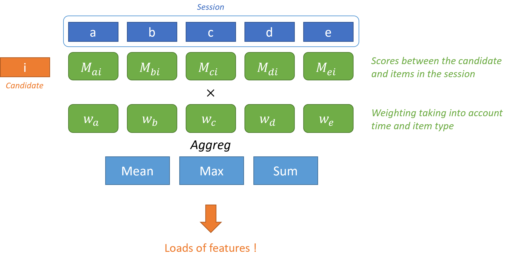
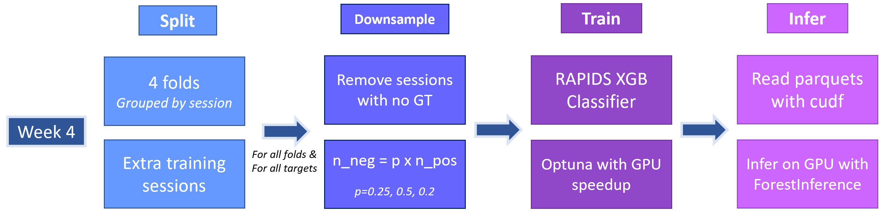

# 3rd place solution to the OTTO – Multi-Objective Recommender System Kaggle Competition - Theo's Part

#### Status :
- Document code : Done
- Clean notebooks : Approximately done
- Make ReadMe : Done


## Introduction - Adapted from ([kaggle](https://www.kaggle.com/competitions/otto-recommender-system/discussion/382975))

The pipeline follows the classical candidates extraction & reranker scheme.

- CV = 0.5917 - [0.5621, 0.4438, 0.6706] -> LB 0.6028

Clicks is single model, I blend a few XGBs for carts & orders but the boost is small. Blending with models from my teammates gave our Public 0.60437 (3rd) / Private 0.60382 (3rd) LB !

### Candidates

I use the candidates from Chris ([link](https://www.kaggle.com/competitions/otto-recommender-system/discussion/383013)), as well as a slightly modified version of the ones from his public kernel. This results in approx. 80 candidates per sessions.

### Feature engineering

Most of my (744) features come from the following process :

- Compute item-item scores (such as w2v similarities, matrix factorization similarity, Chris' covisitation matrices coefficients) between the candidate and items in the session
- Compute a weight adding information about to the item position in the session, timestamp, and type
- Aggregate !
 


Features are computed per batch on a 32Gb V100 using RAPIDS. It's fast :)

### Overall pipeline

I tune an Optuna for each fold (which is not a good practice, but I had a really reliable CV setup), pipeline can be a bit long to run but actually, the bottleneck is reading huge parquet files. Heavy downsampling makes it possible to have everything in RAM, and to train on GPU using the tricks Chris shared publicly.



## How to use the repository

### Prerequisites

- Clone the repository
- Requirements :
  - RAPIDS ! Using the latest stable version should work.
  - `pip install -r requirements.txt`
  - Bunch of stuff that doesn't really matter that much

- Download the data :
  - Put the competition data from [Kaggle](https://www.kaggle.com/competitions/otto-recommender-system/data) in the `input` folder


### Run The pipeline

Most of the pipelines is handled in notebooks. The order in which they should be run is specified in the name.
Pipeline should run fine in a machine with a 32GB. 

- Prepare the data using `1-Preparation.ipynb`.
- Create covisitation matrices using `2-Matrices_Chris.ipynb` and `2-Matrices_Theo.ipynb`. Notebooks have to be run with `MODE="val"` and `MODE="test"`
- Create candidates matrices using `3-Candidates.ipynb`. Notebooks have to be run with `MODE="val"`, `MODE="test"` and `MODE="extra"`.
- Create embeddings matrices using `4-Matrix_Factorization.ipynb`, `4-Seq2Seq_Giba.ipynb` and `4-Word2Vec.ipynb`. Notebooks have to be run with `MODE="val"` and `MODE="test"`
- Create features using the `fe_main.py` script in the `src` folder. Use `python fe_main.py --mode MODE` with modes `val`, `test` and `extra`.
- Train an XGBoost model using `6-XGB.ipynb`
- Evaluate your ensembles and generate submission files using `7-Blend.ipynb`

## Code structure

If you wish to dive into the code, the repository naming should be straight-forward. Each function is documented.
The structure is the following :

```
src
├── data
│   ├── candidates_chris.py         # Chris' candidates utils
│   ├── candidates.py               # Theo's candidates utils
│   ├── covisitation.py             # Theo's covistation matrices
│   ├── fe.py                       # Feature engineering
│   └── preparation.py              # Data preparation utils
├── inference           
│   ├── boosting.py                 # Main file
│   └── predict.py                  # Predict function
├── model_zoo 
│   ├── __init__.py
│   ├── lgbm.py                     # LGBM Ranker kept for legacy
│   └── xgb.py                      # XGBoost classifier
├── otto_src                        
│   ├── evaluate.py                 # From the competition repo
│   ├── labels.py                   # From the competition repo
│   ├── my_split.py                 # My custom splitting functions
│   └── testset.py                  # From the competition repo
├── training           
│   └── boosting.py                 # Trains a boosting model
├── utils          
│   ├── load.py                     # Data loading utils 
│   ├── logger.py                   # Logging utils
│   ├── metrics.py                  # Metrics for the competition
│   ├── plot.py                     # Plotting utils
│   └── torch.py                    # Torch utils
│
├── fe_main.py                      # Main for feature engineering
└── params.py                       # Main parameters
``` 
